

# Beyond Correctness: Harmonizing Process and Outcome Rewards through RL Training

## Table of Contents
- [Introduction](#introduction)

## Introduction
### Current Dilemma: Process vs. Outcome

Current Reinforcement learning with verifiable rewards (RLVR) faces a challenge:

- Outcome Reward Models (ORMs): They are "results-oriented," caring only whether the final answer is correct. This is reliable but also "blind"—they cannot distinguish between a logically perfect solution and one with flawed reasoning steps but happens to be correct.

- Process Reward Models (PRMs): They are "process-oriented" and can evaluate each step of the reasoning. This provides finer-grained guidance, but PRMs themselves are often inaccurate and susceptible to "reward hacking" by the model.

Simply blending the two often introduces unstable training signals and can even lead to worse performance.

### Our Solution: PROF - PRocess cOnsistency Filter

We propose **PRocess cOnsistency Filter (PROF)**, an effective data process curation method that the strengths of process rewards (PRMs) and outcome rewards (ORMs). The core idea of PROF is not to use the PRM's score directly for training, but rather to use it as a "consistency filter" to select the highest-quality training data. Specifically, PROF filters the correct and incorrect samples separately and remove the most deceptive "noise":

- Correct: remove the responses with the lowest PRM values averaged over steps
- Incorrect: remove  the responses with the highest PRM values averaged over steps

The number to remove in correct and incorrect group is to balance the correct-incorrect ratio.

  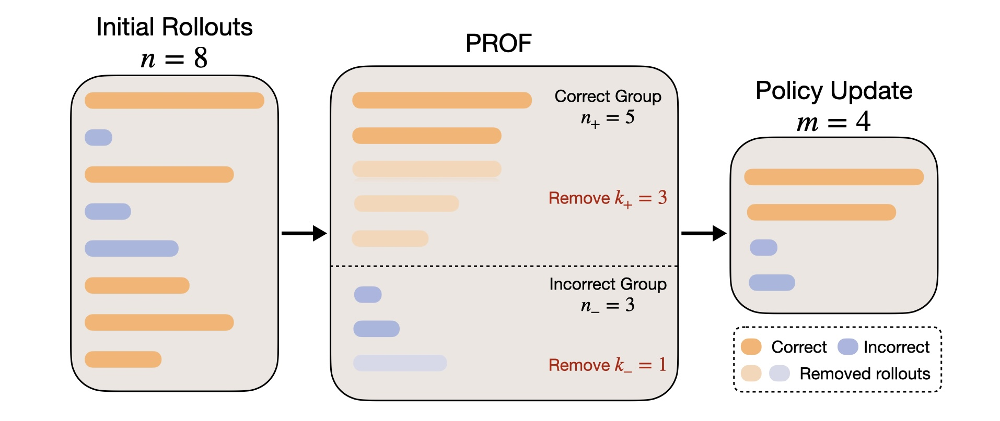

### Main Results

  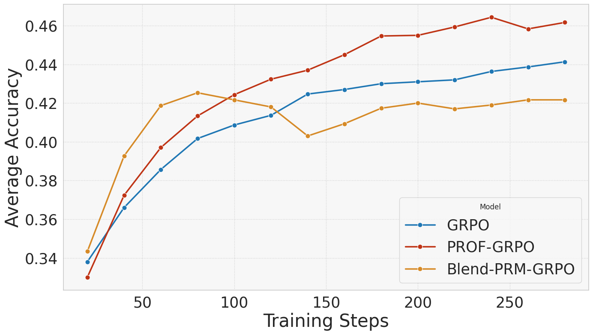
  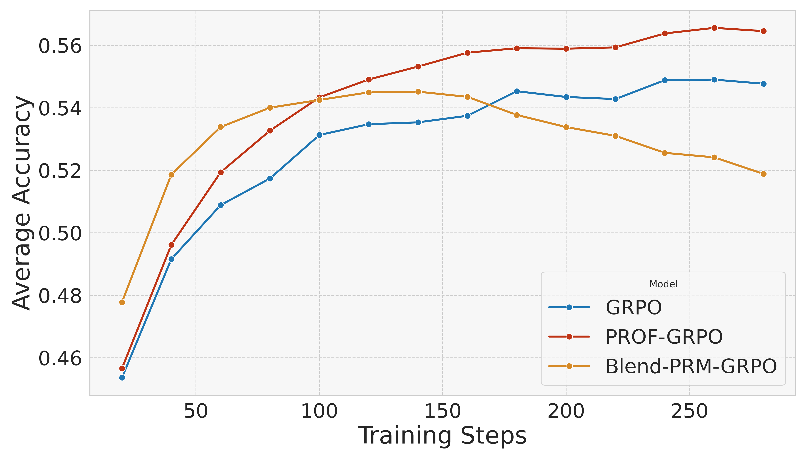

  
| Model | Algorithm | Math500 | Minerva Math | Olympiad Bench | AIME24 | AMC23 | Average |
| :--- | :--- | :--- | :--- | :--- | :--- | :--- | :--- |
| Qwen2.5-Math-1.5B-base | Base | 39.9 | 11.4 | 19.1 | 3.5 | 23.6 | 19.5 |
| | GRPO | 70.3 | 29.1 | 33.0 | 9.0 | 44.5 | 37.2 |
| | Blend | 67.6 | 27.8 | 31.1 | 7.7 | 42.5 | 35.3 |
| | **PROF-GRPO** | **73.2** | **30.0** | **36.1** | **9.6** | **49.1** | **39.6** |
| Qwen2.5-Math-7B-base | Base | 42.0 | 12.8 | 19.2 | 12.9 | 30.0 | 23.4 |
| | GRPO | 81.6 | 37.2 | 45.5 | **20.6** | 64.4 | 49.9 |
| | Blend | 81.7 | 36.7 | 45.0 | 15.2 | 58.0 | 47.3 |
| | **PROF-GRPO** | **83.1** | **39.0** | **47.8** | 17.5 | **70.9** | **51.7** |

_**Table 1:** Performance of different algorithms across five benchmarks including Math500, Minerva Math, Olympiad Bench, AMC2023 and AIME2024. We denote Blend-PRM-GRPO by Blend for short. We tune all the algorithms to their best performance and refer the readers to Appendix for the detailed parameter setup. The reported accuracy is average@16 under temperature 1.0._

### Main Takeways:

1. **PROF-GRPO v.s. Vanilla GRPO:** Compared to vanilla GRPO, PROF-GRPO consistently improves final accuracy by around $2\\%$. More improtantly, PROF-GRPO can effectively differentiate and filter out the flawed responses with correct final answer and reduce misleading gradients, while ORM cannot distinguish those samples. An example of flawed responses filtered out by PROF is presented below.

  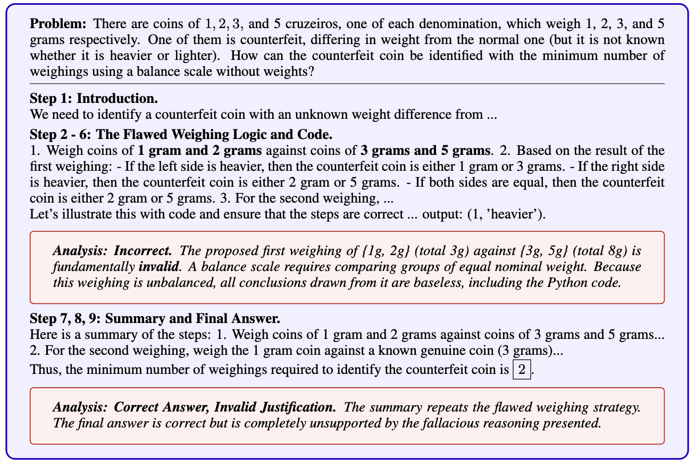

2. **PROF-GRPO v.s. Blend:** Blend denotes naively mixing PRM with ORM in the objective and is a common way to apply PRM into RL training. As shown in the figure and table above, Blend is outperformed by PROF-GRPO by over $4\\%$ and suffers from severe reward hacking due to the mixing gradients of PRM and ORM.
3. **Improved Reasoning Quality:** Our method not only increases the accuracy of the final answer but also strengthens the quality and reliability of the model's intermediate reasoning steps by segmenting CoT into more **simple and easy-to-verify** steps.

  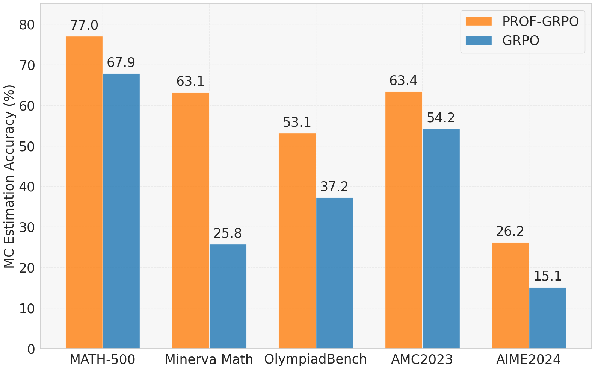
  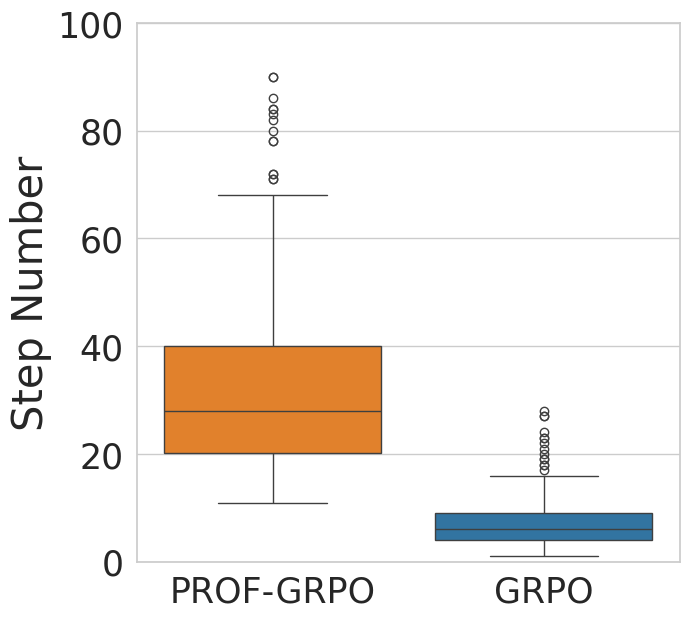
  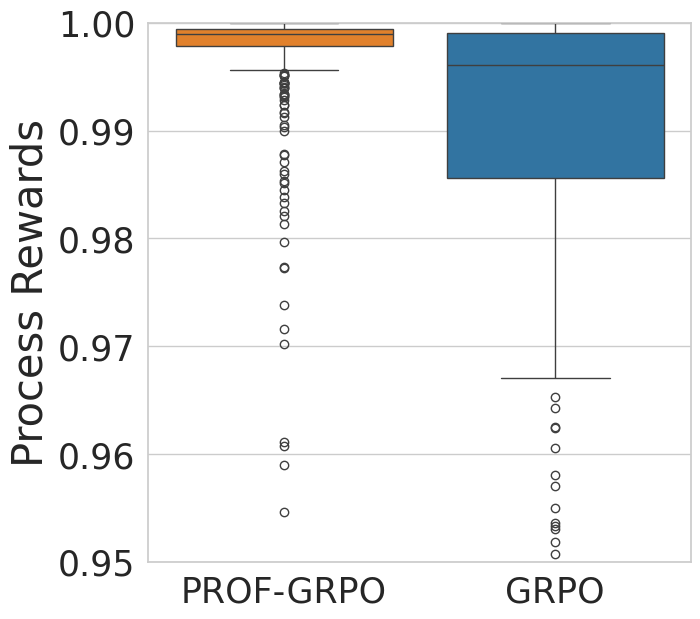
  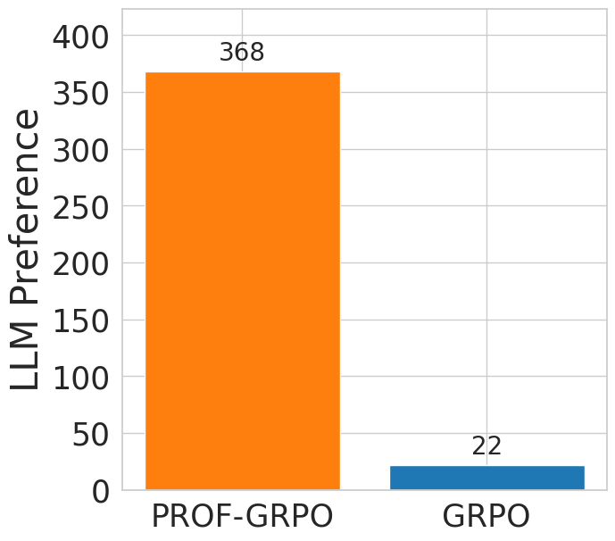

4. **Filter Both or Correct** Filtering only correct samples with consistency and incorrect samples randomly (Filter-Correct) performs comparably to filtering both correct and incorrect samples with consistency (Filter-Both), while "Both" converges more efficiently. This implies that the quality of correct responses is the crucial part for online training. Moreover, through experiemnts on more rollout numbers and LLaMA-3.2-3B-instruct, we find that for robustness, especially when the PRM is untrustworthy or out-of-distribution, Filter-correct is the safer option as it constrains the PRM's influence.

  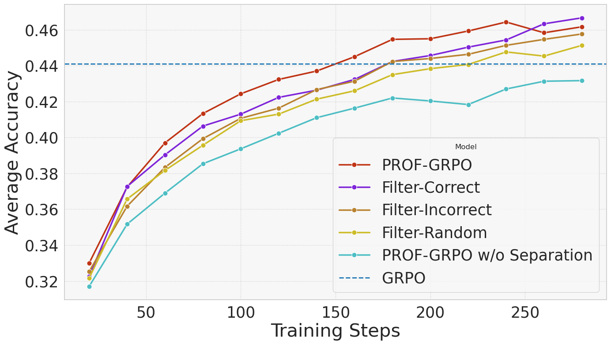
  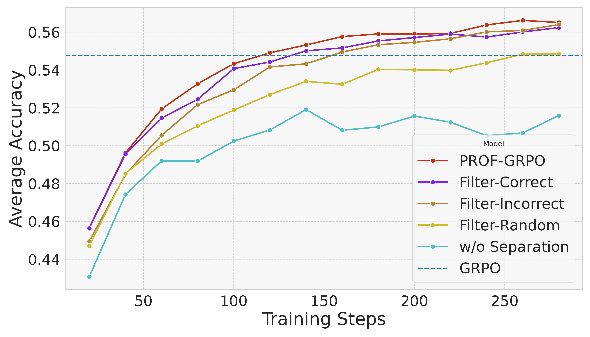
  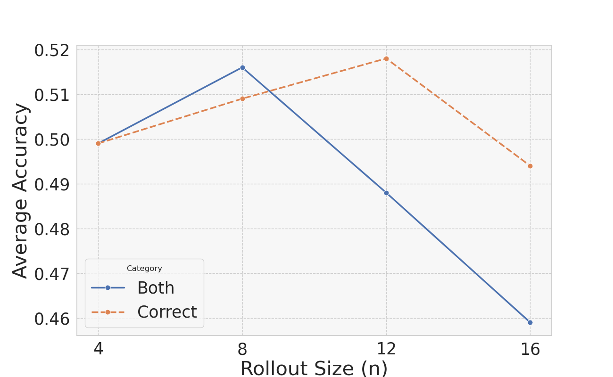

  
| Algorithm | Math500 | Minerva Math | Olympiad Bench | AIME24 | AMC23 | Average |
| :--- | :--- | :--- | :--- | :--- | :--- | :--- |
| Base | 30.0 | 8.8 | 6.1 | 2.3 | 10.6 | 11.6 |
| GRPO | 50.5 | 18.8 | 17.9 | 5.0 | 25.6 | 23.6 |
| Blend-PRM-GRPO | 37.2 | 13.1 | 9.9 | 1.0 | 17.2 | 15.7 |
| PROF-GRPO (Both) | 50.4 | 19.1 | 18.7 | 3.5 | 27.8 | 23.9 |
| **PROF-GRPO (Correct)** | **52.4** | **19.5** | **19.8** | **6.7** | **28.6** | **25.4** |
| PROF-GRPO (Incorrect) | 49.0 | 18.0 | 17.3 | 5.4 | 23.9 | 22.7 |

_**Table 2:** The test accuracy of different methods initialized from LLaMA-3.2-3B-instruct that is average@16 under temperature 1.0 and further averaged across all the five benchmarks._

## Codes and scripts will be released soon!
